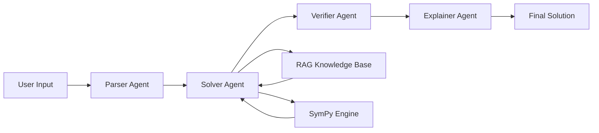

# 🧮 Math Mentor - AI-Powered Math Problem Solver


**Math Mentor** is an intelligent, multimodal AI system designed to solve JEE-level mathematics problems through text, image, and audio inputs. Built with a multi-agent architecture, RAG (Retrieval-Augmented Generation), and symbolic computation capabilities.

---

## 🌟 Features

### 🎯 **Core Capabilities**
- **Multi-modal Input Support**
  - 📝 **Text Input** - Type math problems directly
  - 📷 **Image Upload** - OCR extraction from handwritten/printed problems
  - 🎤 **Audio Input** - Voice transcription using Whisper AI

### 🤖 **Multi-Agent Architecture**
- **Parser Agent** - Analyzes and categorizes math problems
- **Solver Agent** - Solves problems using LLM + SymPy
- **Verifier Agent** - Validates solutions for correctness
- **Explainer Agent** - Generates step-by-step explanations

### 🧠 **Advanced Features**
- ✅ **Human-in-the-Loop (HITL)** - Low confidence triggers manual verification
- 📚 **RAG Knowledge Base** - Retrieves relevant mathematical context
- 🧮 **SymPy Integration** - Symbolic math computation
- 💾 **Memory Storage** - Stores past problems and solutions
- 🔄 **Similar Problem Detection** - Finds related problems from history
- 📊 **Confidence Scoring** - OCR and transcription confidence metrics

---

## 📁 Project Structure

```
math-mentor-ai/
│
├── app.py                          # Main Streamlit application
│
├── agents/                         # Multi-agent system
│   ├── __init__.py
│   ├── parser_agent.py            # Problem parsing & categorization
│   ├── solver_agent.py            # Problem solving with RAG + SymPy
│   ├── verifier_agent.py          # Solution verification
│   └── explainer_agent.py         # Step-by-step explanation generation
│
├── multimodal/                     # Input processors
│   ├── __init__.py
│   ├── ocr_processor.py           # Image OCR with EasyOCR
│   └── audio_processor.py         # Audio transcription with Whisper
│
├── rag/                            # RAG system
│   ├── __init__.py
│   ├── knowledge_base/            # Math knowledge documents
│   │   └── *.txt                  # Text files with math content
│   └── vectorstore/               # Vector database
│       ├── __init__.py
│       ├── vectorstore.py         # FAISS vector store implementation
│       ├── index.faiss            # FAISS index file (auto-generated)
│       └── metadata.json          # Vector metadata (auto-generated)
│
├── memory/                         # Memory system
│   ├── __init__.py
│   ├── store.py                   # Memory storage & retrieval
│   └── interactions.json          # Stored interactions (auto-generated)
│
├── utils/                          # Utility functions
│   ├── __init__.py
│   └── helpers.py                 # Helper functions
│
├── create_knowledge_base.py       # Script to create knowledge base
├── requirements.txt               # Python dependencies
├── .env.example                   # Environment variables template
├── .gitignore                     # Git ignore rules
└── README.md                      # This file
```

---

## 🚀 Getting Started

### Prerequisites

- **Python 3.11+**
- **GROQ API Key**
- **Git**

### Installation

1. **Clone the repository**
   ```bash
   git clone https://github.com/yourusername/math-mentor-ai.git
   cd math-mentor-ai
   ```

2. **Create virtual environment**
   ```bash
   python -m venv venv
   source venv/bin/activate  # On Windows: venv\Scripts\activate
   ```

3. **Install dependencies**
   ```bash
   pip install -r requirements.txt
   ```

4. **Set up environment variables**
   ```bash
   cp .env.example .env
   ```
   
   Edit `.env` and add your GROQ API key:
   ```env
   GROQ_API_KEY=your_openai_api_key_here
   ```

5. **Create knowledge base** (Optional - runs automatically on first startup)
   ```bash
   python create_knowledge_base.py
   ```

6. **Run the application**
   ```bash
   streamlit run app.py
   ```

7. **Open in browser**
   ```
   http://localhost:8501
   ```

---

## 📦 Dependencies

### Core Libraries
```
streamlit>=1.32.0
openai>=1.12.0
langchain>=0.1.9
langchain-openai>=0.0.6
```

### AI & ML
```
sentence-transformers>=2.4.0
faiss-cpu>=1.7.4
easyocr>=1.7.0
openai-whisper>=20231117
torch>=2.0.0
```

### Math & Computation
```
sympy>=1.12
numpy>=1.24.0
```

### Utilities
```
python-dotenv>=1.0.0
Pillow>=10.2.0
```

---

## 🎯 Usage

### 1️⃣ **Text Input**
Simply type your math problem in the text area:
```
Example: Solve x² - 4x + 4 = 0
```

### 2️⃣ **Image Upload**
Upload a clear image of your handwritten or printed math problem. The system will:
- Extract text using OCR
- Show confidence score
- Allow manual correction if confidence is low

### 3️⃣ **Audio Input**
Record or upload audio of yourself reading the problem:
- Supported formats: MP3, WAV, M4A, WEBM, OGG
- Automatic transcription with Whisper
- Editable transcribed text

---

## 🧠 How It Works

### Multi-Agent Workflow



### Process Flow

1. **Input Processing** 
   - Text: Direct input
   - Image: OCR with EasyOCR
   - Audio: Transcription with Whisper

2. **Parsing** 
   - Extract problem components
   - Identify topic (algebra, calculus, etc.)
   - Determine difficulty level

3. **Solving**
   - Retrieve relevant knowledge from RAG
   - Solve using LLM (GPT-4)
   - Compute symbolic solution with SymPy

4. **Verification**
   - Validate solution correctness
   - Check for logical errors
   - Calculate confidence score

5. **Explanation**
   - Generate step-by-step breakdown
   - Provide conceptual understanding
   - Show final answer

6. **Memory Storage**
   - Store problem and solution
   - Enable similar problem detection
   - Learn from user feedback

---

## 🔧 Configuration

### Environment Variables

Create a `.env` file in the root directory:

```env
# GROQ API
GROQ_API_KEY=your_openai_api_key_here

# Model Configuration (Optional)
GROQ_MODEL=llama-3.3-70b-versatile
EMBEDDING_MODEL=all-Mini-LM-V5

# Vector Store (Optional)
VECTOR_STORE_PATH=rag/vectorstore
KNOWLEDGE_BASE_PATH=rag/knowledge_base

# Memory (Optional)
MEMORY_PATH=memory/interactions.json
```

---

## 📊 System Architecture

### Agent Architecture

#### **Parser Agent**
- **Purpose**: Analyze and categorize math problems
- **Output**: Structured problem representation
- **Features**: Topic detection, difficulty assessment

#### **Solver Agent**
- **Purpose**: Solve mathematical problems
- **Tools**: GPT-4, RAG, SymPy
- **Features**: Context-aware solving, symbolic computation

#### **Verifier Agent**
- **Purpose**: Validate solution correctness
- **Output**: Verification status, confidence score
- **Features**: Error detection, logical validation

#### **Explainer Agent**
- **Purpose**: Generate explanations
- **Output**: Step-by-step solution breakdown
- **Features**: Clear explanations, concept clarification

### RAG System

- **Embedding Model**: `text-embedding-3-small`
- **Vector Store**: FAISS
- **Retrieval**: Top-K similarity search
- **Knowledge Base**: Custom math documents

---

## 🤝 Contributing

Contributions are welcome! Please follow these steps:

1. Fork the repository
2. Create a feature branch (`git checkout -b feature/AmazingFeature`)
3. Commit your changes (`git commit -m 'Add some AmazingFeature'`)
4. Push to the branch (`git push origin feature/AmazingFeature`)
5. Open a Pull Request

---

## 🐛 Known Issues

- OCR accuracy depends on image quality
- Audio transcription requires clear pronunciation
- Large images may take longer to process
- SymPy may not handle all problem types

---

## 🚧 Roadmap

- [ ] Add support for graphing problems
- [ ] Implement LaTeX rendering for equations
- [ ] Add more knowledge base topics (geometry, trigonometry)
- [ ] Support for multiple languages
- [ ] Mobile app version
- [ ] Real-time collaboration features
- [ ] Export solutions as PDF

---

## 📝 License

This project is licensed under the MIT License - see the [LICENSE](LICENSE) file for details.

---

## 🙏 Acknowledgments

- **GROQ** - Groq 
- **LangChain** - Agent framework
- **Streamlit** - Web framework
- **EasyOCR** - OCR engine
- **SymPy** - Symbolic mathematics
- **FAISS** - Vector similarity search

---

## 📧 Contact

**Your Name** - [@yourhandle](https://twitter.com/yourhandle) - your.email@example.com

**Project Link**: [https://github.com/yourusername/math-mentor-ai](https://github.com/yourusername/math-mentor-ai)

---

## ⭐ Star History

[](https://star-history.com/#yourusername/math-mentor-ai&Date)

***

## 📄 **Additional Files to Create**

### `.env.example`
```env
# OpenAI API Key (Required)
OPENAI_API_KEY=your_openai_api_key_here

# Model Configuration (Optional)
OPENAI_MODEL=gpt-4
EMBEDDING_MODEL=text-embedding-3-small

# Paths (Optional - use defaults)
VECTOR_STORE_PATH=rag/vectorstore
KNOWLEDGE_BASE_PATH=rag/knowledge_base
MEMORY_PATH=memory/interactions.json
```

### `LICENSE` (MIT License)
```
MIT License
```

### `Live:` https://math-jee-mentor-ai-21.streamlit.app/
### `Github link:` https://github.com/Lakshaygoel4321
